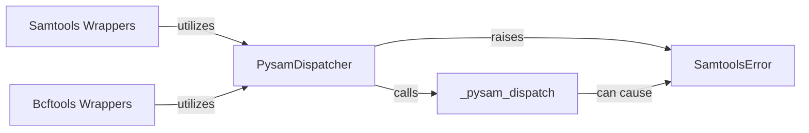

## Details

This component provides a Pythonic wrapper and a robust dispatch mechanism for executing external bioinformatics command-line tools, specifically `samtools` and `bcftools`. It allows users to leverage the full functionality of these powerful C-based utilities directly from their Python scripts, abstracting away the complexities of subprocess management and command-line argument construction. It acts as a crucial bridge between the high-level Python application logic and the low-level C utilities.

### PysamDispatcher

This component provides the core dispatch mechanism for executing `samtools` and `bcftools` commands. It acts as a high-level Python interface that translates Python function calls into arguments suitable for the underlying C utilities, managing the execution flow, capturing output, and handling error codes. It centralizes the logic for invoking external tools.

**Related Classes/Methods**:

- <a href="https://github.com/pysam-developers/pysam/blob/master/pysam/utils.py#L1-L1" target="_blank" rel="noopener noreferrer">`pysam.utils.PysamDispatcher` (1:1)</a>

### _pysam_dispatch

This is the crucial Foreign Function Interface (FFI) layer, implemented in Cython. It is directly responsible for calling the compiled C utilities (`samtools`, `bcftools`) and managing the low-level interaction between Python and C, including argument passing, execution, and raw result retrieval. It's the direct bridge to the external C libraries.

**Related Classes/Methods**:

- `pysam.libcutils._pysam_dispatch` (1:1)

### SamtoolsError

This component defines a custom exception class specifically for errors that originate from the underlying `samtools`, `bcftools` utilities, or HTSlib. It ensures robust error management by providing specific error contexts to the Python user, allowing for more granular error handling within the Python application.

**Related Classes/Methods**:

- <a href="https://github.com/pysam-developers/pysam/blob/master/pysam/utils.py#L1-L1" target="_blank" rel="noopener noreferrer">`pysam.utils.SamtoolsError` (1:1)</a>

### Samtools Wrappers

This module provides specific Python functions that wrap individual `samtools` commands (e.g., `view`, `sort`, `index`). These functions offer a user-friendly, Pythonic interface to `samtools`, abstracting away the command-line syntax and internally utilizing the `PysamDispatcher` for execution.

**Related Classes/Methods**:

- <a href="https://github.com/pysam-developers/pysam/blob/master/pysam/samtools.py#L1-L1" target="_blank" rel="noopener noreferrer">`pysam.samtools` (1:1)</a>

### Bcftools Wrappers

Similar to `Samtools Wrappers`, this module provides specific Python functions that wrap individual `bcftools` commands (e.g., `call`, `view`, `norm`). These functions offer a user-friendly, Pythonic interface to `bcftools`, abstracting away the command-line syntax and internally utilizing the `PysamDispatcher` for execution.

**Related Classes/Methods**:

- <a href="https://github.com/pysam-developers/pysam/blob/master/pysam/bcftools.py#L1-L1" target="_blank" rel="noopener noreferrer">`pysam.bcftools` (1:1)</a>

### [FAQ](https://github.com/CodeBoarding/GeneratedOnBoardings/tree/main?tab=readme-ov-file#faq)