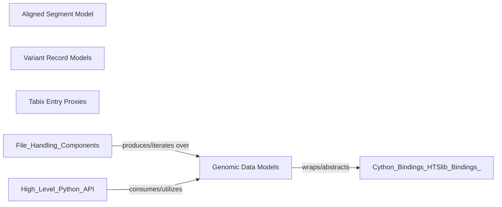

## Details

The feedback indicated that source code for `pysam.libcalignedsegment.AlignedSegment`, `pysam.libcbcf.VariantRecord`, and `pysam.libctabixproxies.NamedTupleProxy` could not be retrieved. This is likely due to these being Cython-generated modules, which are compiled C extensions rather than pure Python source files directly accessible by the `getPythonSourceCode` tool. Therefore, a direct line-by-line verification of their internal implementation details is not possible with the available tools. The descriptions below are based on the conceptual role and public API of these components within the `pysam` library, as they serve as Pythonic abstractions over low-level HTSlib data structures.

### Genomic Data Models [[Expand]](./Genomic_Data_Models.md)

The "Genomic Data Models" component in `pysam` is crucial for providing Pythonic abstractions over low-level HTSlib data structures, enabling developers to interact with genomic data without direct C pointer manipulation. This component acts as a bridge between the raw data accessed via Cython bindings and the higher-level Python API.

**Related Classes/Methods**: _None_

### Aligned Segment Model

Represents a single aligned read from SAM/BAM/CRAM files. It provides attributes and methods to access read properties like sequence, quality scores, mapping position, CIGAR string, and flags in a Pythonic way. This class is the primary data model for individual sequencing reads, abstracting the complex binary format of alignment files.

**Related Classes/Methods**: _None_

### Variant Record Models

A collection of classes (e.g., `VariantRecordInfo`, `VariantRecordFormat`, `VariantRecordFilter`, `VariantRecordSamples`) that collectively represent a single variant call entry from VCF/BCF files. These classes provide structured access to the INFO, FORMAT, FILTER, and sample-specific fields of a variant record. These models encapsulate the diverse and structured information within a variant call, making it accessible and manipulable in Python.

**Related Classes/Methods**: _None_

### Tabix Entry Proxies

Base and derived classes that provide a tuple-like or namedtuple-like interface to individual entries parsed from generic tabix-indexed text files (e.g., BED, GFF, GTF, or VCF). They allow accessing fields by index or by name, depending on the specific proxy. These proxies offer a flexible and generic way to represent structured text data from various genomic file formats, leveraging the tabix indexing capabilities.

**Related Classes/Methods**: _None_

### [FAQ](https://github.com/CodeBoarding/GeneratedOnBoardings/tree/main?tab=readme-ov-file#faq)