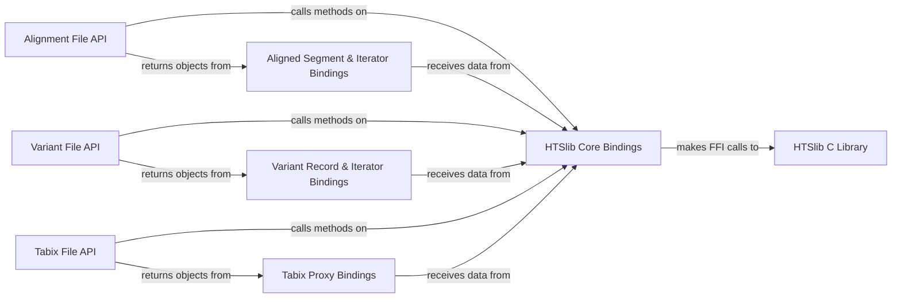

## Details

The `Indexing & Querying` component in `pysam` is responsible for enabling efficient, region-based retrieval of data from various genomic file formats (SAM/BAM, VCF/BCF, Tabix). It achieves this by managing the creation, loading, and utilization of specialized genomic indices. This component provides high-level Python interfaces for users to perform queries, which are then translated through Cython bindings into low-level calls to the highly optimized HTSlib C library. This layered architecture ensures both ease of use for Python developers and the high performance required for large-scale genomic datasets.

The component operates in a layered fashion:

1.  **High-Level Python API:** Users interact with classes like `AlignmentFile`, `VariantFile`, and `TabixFile` to open and query genomic data. These classes expose intuitive methods (e.g., `fetch()`) for specifying genomic regions.

2.  **Cython Bindings:** When a query is initiated, the call is passed to the corresponding Cython modules (e.g., `libcalignmentfile.pyx`, `libcbcf.pyx`, `libctabix.pyx`). These modules act as a bridge, handling data type conversions between Python and C, managing memory, and making direct Foreign Function Interface (FFI) calls to the underlying HTSlib C functions.

3.  **HTSlib C Library:** This is the core engine where the actual indexing and querying logic resides. HTSlib provides highly optimized C functions for reading indexed genomic files, navigating to specific regions using the index, and efficiently retrieving records. It manages the index data structures and performs low-level file I/O.

4.  **Data Representation:** The retrieved C-level data is then converted back into Python objects (e.g., `AlignedSegment`, `VariantRecord`, or structured Tabix proxies) by the Cython bindings, making the queried data accessible and usable within Python.

The primary purpose is to significantly enhance the performance of data access for large genomic files. By leveraging indices, the component allows users to quickly retrieve only the data relevant to a specific genomic region, avoiding the need to parse entire files. This is critical for bioinformatics workflows that frequently involve targeted analysis of genomic loci.

### Alignment File API

Provides the high-level Python interface for interacting with SAM/BAM files. It includes methods for opening files, creating/loading BAM indices, and performing region-based queries to retrieve alignment records. It manages `AlignmentFile` objects and their associated iterators.

**Related Classes/Methods**:

- `pysam.libcalignmentfile` (1:1)

- `pysam.libcalignmentfile` (1:1)

- <a href="https://github.com/pysam-developers/pysam/blob/master/pysam/Pileup.py#L1-L1" target="_blank" rel="noopener noreferrer">`pysam.Pileup` (1:1)</a>

### Variant File API

Offers the high-level Python interface for handling VCF/BCF files. This includes functionalities for reading, writing, and querying variant records by genomic region, relying on BCF or Tabix indices. It also exposes classes for managing BCF and Tabix indices directly.

**Related Classes/Methods**:

- `pysam.libcbcf` (1:1)

- `pysam.libcbcf` (1:1)

### Tabix File API

Provides the high-level Python interface for generic tab-separated files that are indexed with Tabix. It enables users to open, read, and perform region-based queries on such files, which are common in genomics (e.g., BED, GFF, custom annotation files).

**Related Classes/Methods**:

- `pysam.libctabix` (1:1)

- `pysam.libctabix` (1:1)

### HTSlib Core Bindings

This Cython module provides the foundational, low-level bindings to the HTSlib C library. It exposes core HTSlib functions and data structures necessary for file handling, index management (loading, creating), and iterator creation for region-based queries across all file types (SAM/BAM, VCF/BCF, Tabix).

**Related Classes/Methods**:

- `pysam.libchtslib` (1:1)

- `pysam.libchtslib` (1:1)

- `pysam.libchtslib` (1:1)

### Aligned Segment & Iterator Bindings

These Cython modules define the `AlignedSegment` object, representing a single read in a BAM/SAM file, and the various iterator classes (e.g., `IteratorRowRegion`, `IteratorColumnRegion`) that enable efficient traversal of alignment records within specified genomic regions. They handle the conversion of C-level alignment data into Python objects.

**Related Classes/Methods**:

- `pysam.libcalignedsegment` (1:1)

- `pysam.libcalignedsegment` (1:1)

- `pysam.libcalignedsegment` (1:1)

- `pysam.libcalignmentfile` (1:1)

### Variant Record & Iterator Bindings

This component defines the `VariantRecord` object and the iterators (`BCFIterator`, `TabixIterator`) used to traverse variant records within VCF/BCF files. It handles the conversion of C-level variant data into Python objects, including parsing INFO, FORMAT, and SAMPLE fields.

**Related Classes/Methods**:

- `pysam.libcbcf` (1:1)

### Tabix Proxy Bindings

This module provides proxy classes (e.g., `BedProxy`, `GTFProxy`, `VCFProxy`) that wrap raw tabix-parsed lines into more structured, named-tuple-like Python objects. This enhances the usability of data retrieved from generic Tabix-indexed files by providing convenient attribute access.

**Related Classes/Methods**:

- `pysam.libctabixproxies` (1:1)

- `pysam.libctabixproxies` (1:1)

- `pysam.libctabixproxies` (1:1)

### HTSlib C Library

The core C library (HTSlib) that `pysam` wraps. It contains the highly optimized algorithms and data structures for creating, loading, and querying genomic indices (BAM, Tabix, BCF) and for performing high-performance region-based data access. This is where the actual file parsing and index lookup logic resides.

**Related Classes/Methods**: _None_

### [FAQ](https://github.com/CodeBoarding/GeneratedOnBoardings/tree/main?tab=readme-ov-file#faq)