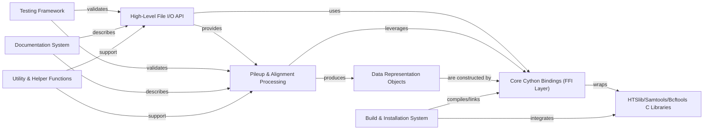

## Details

An overview of the fundamental components within `pysam`, focusing on the `Pileup Analysis` subsystem, along with their responsibilities, source files, and interactions. These components are chosen because they represent distinct layers and functionalities crucial for a Python library that wraps high-performance C libraries for bioinformatics.

### High-Level File I/O API

This component provides the primary, user-friendly Python interface for interacting with various genomic data file formats such as BAM/SAM/CRAM (for alignments), VCF/BCF (for variants), and FASTA/FASTQ (for sequences), as well as Tabix-indexed generic files. It abstracts away the complexities of file parsing and low-level data access, offering Pythonic objects and methods for common operations.

**Related Classes/Methods**:

- `pysam.libcalignmentfile` (1:1)

- `pysam.libcsamfile` (1:1)

- `pysam.libcbcf` (1:1)

- `pysam.libctabix` (1:1)

- `pysam.libcfaidx` (1:1)

### Pileup & Alignment Processing

This component is dedicated to generating and analyzing pileup data from alignment files. It encapsulates the complex logic of iterating through genomic positions, identifying aligned reads, and detecting variations like indels and substitutions. It provides Pythonic objects (`PileupColumn`, `PileupRead`) to represent pileup columns and reads for further analysis, abstracting the low-level C library interactions.

**Related Classes/Methods**:

- `pysam.libcalignmentfile:pileup` (1:1)

- `pysam.libcalignedsegment:AlignedSegment` (1:1)

- `pysam.libcalignedsegment:PileupColumn` (1:1)

- `pysam.libcalignedsegment:PileupRead` (1:1)

### Core Cython Bindings (FFI Layer)

This is the critical Foreign Function Interface (FFI) layer, implemented in Cython (`libc*.pyx` modules). It directly binds to and wraps the underlying HTSlib, Samtools, and Bcftools C libraries. This layer is responsible for exposing low-level C functions and data structures to Python, handling memory management, and performing efficient type conversions between Python and C.

**Related Classes/Methods**:

- `pysam.libchtslib` (1:1)

- `pysam.libcalignedsegment` (1:1)

- `pysam.libcalignmentfile` (1:1)

- `pysam.libcsamfile` (1:1)

- `pysam.libcbcf` (1:1)

- `pysam.libcfaidx` (1:1)

- `pysam.libctabix` (1:1)

- `pysam.libctabixproxies` (1:1)

### HTSlib/Samtools/Bcftools C Libraries

These are the external, foundational C libraries that perform the actual heavy lifting of genomic data manipulation. They provide the core algorithms for file parsing, alignment processing, variant calling, and indexing. `pysam` acts as a high-level Python wrapper around these highly optimized C implementations.

**Related Classes/Methods**:

- `HTSlib/Samtools/Bcftools` (1:1)

### Data Representation Objects

These are Python classes that encapsulate and provide structured, Pythonic access to individual data elements parsed from genomic files. Examples include `AlignedSegment` (representing a single aligned read), `PileupColumn`, `PileupRead`, `VariantRecord`, and various proxy objects for Tabix-indexed data. They abstract the raw C data structures into more usable Python objects.

**Related Classes/Methods**:

- `pysam.libcalignedsegment:AlignedSegment` (1:1)

- `pysam.libcalignedsegment:PileupColumn` (1:1)

- `pysam.libcalignedsegment:PileupRead` (1:1)

- `pysam.libcbcf:VariantRecord` (1:1)

- `pysam.libctabixproxies:ProxyObject` (1:1)

### Build & Installation System

This component manages the entire process of compiling the Cython source code, linking it with the vendored or system-installed C libraries (HTSlib, Samtools, Bcftools), and packaging the `pysam` library for distribution and installation via tools like `pip`.

**Related Classes/Methods**:

- <a href="https://github.com/pysam-developers/pysam/blob/master/setup.py#L1-L1" target="_blank" rel="noopener noreferrer">`setup.py` (1:1)</a>

- <a href="https://github.com/pysam-developers/pysam/blob/master/setup.py#L1-L1" target="_blank" rel="noopener noreferrer">`setup.cfg` (1:1)</a>

- `pysam.config` (1:1)

### Testing Framework

A comprehensive suite of unit and integration tests (primarily using `pytest`) that validate the correctness, performance, and robustness of the `pysam` library across its various functionalities and interfaces. It ensures that changes do not introduce regressions and that the complex interactions between Python, Cython, and C are reliable.

**Related Classes/Methods**:

- `tests` (1:1)

### Documentation System

This component is responsible for generating comprehensive user documentation for the `pysam` library, including detailed API references, practical tutorials, and illustrative examples. It typically uses Sphinx to build the documentation from reStructuredText or Markdown source files.

**Related Classes/Methods**:

- `docs` (1:1)

### Utility & Helper Functions

A collection of miscellaneous Python functions and classes that provide common utilities, error handling mechanisms, and convenience wrappers. These functions support overall library functionality and enhance the user experience, even if not directly part of the core file I/O or pileup logic.

**Related Classes/Methods**:

- <a href="https://github.com/pysam-developers/pysam/blob/master/pysam/__init__.py#L1-L1" target="_blank" rel="noopener noreferrer">`pysam.__init__` (1:1)</a>

- <a href="https://github.com/pysam-developers/pysam/blob/master/pysam/utils.py#L1-L1" target="_blank" rel="noopener noreferrer">`pysam.utils` (1:1)</a>

- <a href="https://github.com/pysam-developers/pysam/blob/master/pysam/version.py#L1-L1" target="_blank" rel="noopener noreferrer">`pysam.version` (1:1)</a>

### [FAQ](https://github.com/CodeBoarding/GeneratedOnBoardings/tree/main?tab=readme-ov-file#faq)