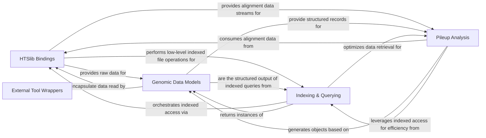

## Details

One paragraph explaining the functionality which is represented by this graph. What the main flow is and what is its purpose.

### HTSlib Bindings

This foundational component provides the direct, low-level Cython bindings to the HTSlib C library. It is responsible for efficient reading, writing, and indexing of common genomic file formats such as SAM/BAM/CRAM, VCF/BCF, FASTA/FASTQ, and Tabix-indexed generic text files. It acts as the primary bridge between Python's ease of use and C's computational power for large-scale genomic data operations.

**Related Classes/Methods**:

### Genomic Data Models [[Expand]](./Genomic_Data_Models.md)

This component defines Pythonic data structures and classes that represent individual genomic records parsed from the underlying HTSlib Bindings. These abstractions (e.g., aligned reads, variant calls, tabix entries) allow developers to easily access, manipulate, and interpret the biological information contained within the files without needing to interact directly with C pointers or low-level data structures.

**Related Classes/Methods**:

### Indexing & Querying [[Expand]](./Indexing_Querying.md)

This component manages the creation, loading, and utilization of genomic indices (e.g., BAM index, Tabix index, BCF index) for efficient region-based data retrieval. It provides iterators and methods to query specific genomic regions or retrieve records based on their coordinates, significantly enhancing performance for large datasets.

**Related Classes/Methods**:

### Pileup Analysis [[Expand]](./Pileup_Analysis.md)

This component is dedicated to generating and analyzing pileup data from alignment files. It handles the complex logic of iterating through genomic positions, identifying aligned reads, and detecting variations like indels and substitutions. It provides Pythonic objects to represent pileup columns and reads for further analysis.

**Related Classes/Methods**:

### External Tool Wrappers [[Expand]](./External_Tool_Wrappers.md)

This component provides a Pythonic wrapper and a robust dispatch mechanism for executing external bioinformatics command-line tools, specifically `samtools` and `bcftools`. It allows users to leverage the full functionality of these powerful C-based utilities directly from their Python scripts, abstracting away the complexities of subprocess management and command-line argument construction.

**Related Classes/Methods**:

- <a href="https://github.com/pysam-developers/pysam/blob/master/pysam/utils.py" target="_blank" rel="noopener noreferrer">`pysam.utils`</a>

- <a href="https://github.com/pysam-developers/pysam/blob/master/pysam/samtools.py" target="_blank" rel="noopener noreferrer">`pysam.samtools`</a>

- <a href="https://github.com/pysam-developers/pysam/blob/master/pysam/bcftools.py" target="_blank" rel="noopener noreferrer">`pysam.bcftools`</a>

### [FAQ](https://github.com/CodeBoarding/GeneratedOnBoardings/tree/main?tab=readme-ov-file#faq)